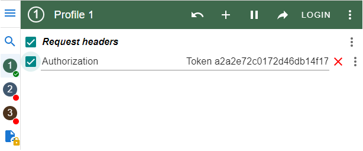

# Cinema-API 

[Click here to visit GitHub repository](https://github.com/phaishuk/Cinema-API)

Cinema-API is a Django-based RESTful API for managing cinema-related data such as movie details, cinema halls, movie sessions, 
and ticket bookings. 
It provides endpoints to perform various CRUD operations and retrieve information related to movies, cinema halls, sessions, and tickets.

___

## Features

- Manage Cinema Halls: Create, retrieve, update, and delete cinema hall information, including the name, number of rows, and number of seats in each row;
- Manage Genres: Add, edit, and delete movie genres with unique names;
- Manage Actors: Add and manage actors' information, including first name and last name;
- Manage Movies: Add, edit, and delete movie details such as title, description, duration, genres, actors, and associated images;
- Schedule Movie Sessions: Set up movie sessions with show times, associated movies, and cinema halls;
- Book Tickets: Allow users to book tickets for specific movie sessions by selecting available seats;
- JWT authenticated;
- Admin panel;
- Documentation for endpoints is located at /api/doc/swagger/;
- Managing orders and tickets;
- Filtering movies and movie sessions.

___

## Installation via GitHub

Be sure that you have installed Postgres DB locally.
If you familiar with this step you can skip this step.

```shell
git clone https://github.com/GeorgePavlej/cinema-api-service.git
cd cinema-service-api
python -m venv venv(Windows) or python3 -m venv venv (Linux or macOS)
venv\Scripts\activate (Windows) or source venv/bin/activate (Linux or macOS)
pip install -r requirements.txt
copy .env.sample -> .env and populate with all required data
```

---

## Run with Docker

Docker and docker-compose must be installed.

```shell
git clone https://github.com/phaishuk/Cinema-API
cd Cinema-API 
docker-compose build
docker-compose up
```

---

## Getting access

To get access you can use next **endpoints**:

- create user via `/api/user/register/`
- get access token via `/api/user/token/`
- use [ModHeader](https://chrome.google.com/webstore/detail/modheader-modify-http-hea/idgpnmonknjnojddfkpgkljpfnnfcklj) to get access to all features

below is a screenshot with example:



___

## API documentation

The API documentation is available at next endpoints:

```djangourlpath
api/doc/swagger/
api/doc/redoc/
```
